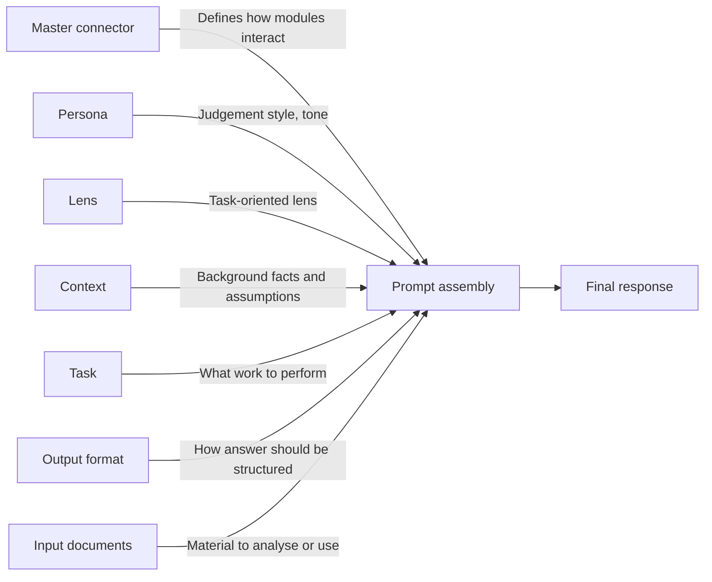

# Modular Prompt Stack

## Core Idea

A task is not handled by one large prompt. It is assembled from reusable modules, where each module has a clearly limited role: connection logic, persona, context, task instruction, output format, and input documents.

This prompt library uses a modular prompt-stack architecture. Each task is assembled from reusable modules: a master connector, optional persona, optional context, task instruction, output format, and input documents.

The design follows established prompt-engineering principles: separating instruction, context, input data, and output format; using role prompting for reviewer perspective; applying context engineering to control the information available to the model; and using prompt chaining for multi-step workflows such as, e.g., audit planning, evidence review, and audit reporting.

## Architecture

A modular prompt stack using role prompting, context engineering, task-specific instruction, and structured output control.

## Logic

Master connector = how to combine modules
Persona = who is thinking and speaking
Lens = how the persona performs
Context = what background matters
Task = what to do
Output = how to present it
Input = what to work on

## Governance

Each module must do one job only.

The persona must not contain task instructions.
The lens only informs perspective.
The task must not contain personality.
The context must not become evidence unless instructed.
The output format must not decide the substance.
The master connector must coordinate, not analyse.

## Example

Persona: professional auditor
Lens: reviewer
Task: review audit plan
Context: organisation and scope
Output: specific output format

---
