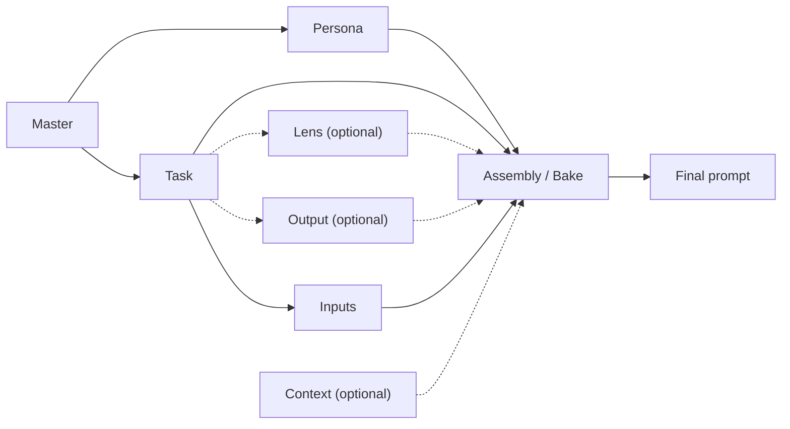

# Modular Prompt Stack

## Core Idea

I write many prompts every day. More often than not, they contain same or similar elements. Even when a task is different. I am writing the same thing over and over again. Even when I invest time and create a great prompt, I cannot really use it directly for another, even similar, task, and have to copy-paste instead.

I want to have a library of prompt modules that I can cleanly combine and reuse. If I spend an hour tuning a prompt component, I want to reuse it enough for that time to pay back with interest.

This is what my Modular Prompt Stack is.

A task is not handled by one large prompt. It is assembled from reusable modules, and each module has a limited and well-defined role. Then, even if the task is different, I am able to reuse cleanly the parts that make up the prompt – persona, background information, perhaps lens or the output format.

This prompt library uses a modular prompt-stack architecture that follows established prompt-engineering principles: separating instruction, context, input data, and output format; using role prompting for reviewer perspective; applying context engineering to control the information available to the model; and using prompt chaining for multi-step workflows.

## Architecture

A modular prompt stack using role prompting, context engineering, task-specific instruction, and structured output control.

## Logic

The stack starts with the [[Master]]. It defines the assembly rules and keeps the modules working together.

[[Persona]] and [[Task]] are the core modules. [[Persona]] defines the role, voice, judgement style, and behaviour. [[Task]] defines the work to be done. Note that certain personas might be better or worse suited to certain tasks.

[[Lens]] is an optional extension of the [[Task]]. It adds a specific angle, emphasis, or review perspective.

[[Output]] is also an optional extension of the [[Task]]. It defines how the result should be structured or presented.

[[Inputs]] are the working material for the [[Task]]. They are normally provided at runtime, either as pasted text, attachments, drafts, source documents, notes, or other material to work on.

[[Context]] is optional fixed framing. It provides stable background information, assumptions, or organisational setting that helps the model understand the task, but it is not the same as input evidence.

[[Assembly]] / [[Bake]] combines the selected modules and inputs into a usable final prompt.

## Governance

Each module must have one clear responsibility.

The [[Master]] coordinates. It should explain how modules are combined, not perform the task itself.

The [[Persona]] defines who is speaking and how judgement is applied. It should not contain task instructions.

The [[Task]] defines what work must be done. It should not define personality, tone, or professional identity.

The [[Lens]] sharpens how the task is approached. It should not replace the task or become a second persona.

The [[Output]] format defines presentation. It should not decide the substance of the answer.

The [[Inputs]] provide the material to work on. They should be treated as source material, not automatically as truth.

The [[Context]] provides stable framing and background.

The [[Assembly]] links together selected modules with [[Obsidian]] [file embed](https://obsidian.md/help/embeds) syntax: `![module_name]`. Assembly files only contain links to other modules and no or very limited content.

The Bake should make the final prompt usable by bringing together the text from all linked modules by "baking together" the assembly content (use [Easy Bake plugin](https://github.com/obsidian-community/obsidian-easy-bake) or `Export to PDF`).

## Examples

#todo Examples will be moved to separate files and reference real modules.

### Improve document – simple

Persona: co-author

Task: improve document

Input: text to be improved

**Complexity upgrades**
Context: dictionary of key terms – secure that approved / established (corporate) terminology is used

Lens: instruction to use specific terminology or specific perspective, e.g., financial view

### Build audit plan – medium-high complexity

Persona: ISO auditor

Lens: audit plan builder

Task: build audit plan

Context: description of the audited organisation, description of its management system, reference list of ISO clauses, reports from previous audits

Output: audit plan format

Input: description of the audited function

Chat window instruction: apply to {audited function}

---
